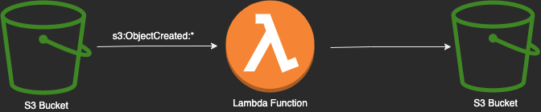

# AWS Lambda function in Java with S3 events integration

<p align="center">
  
</p>

---

The project source includes function code and supporting resources:

> - `src/main` - A Java Lambda function that processes files from one S3 bucket to another.
> - `src/test` - A unit test and helper classes.
> - `build.gradle` - A Gradle build file.
> - `localstack/docker-compose.yml` - A localstack docker-compose file to run the application locally.
> - `localstack/terraform/main.tf` - A terraform file to create all the infrastructure required for the application.

Use the following instructions to deploy the sample application.

# Requirements

>
> - [Java 11 runtime environment (SE JRE)](https://www.oracle.com/java/technologies/javase-downloads.html)
> - [Gradle 7.4](https://gradle.org/releases/) (alternatively you can use the gradle wrapper included)
> - The Bash shell. For Linux and macOS, this is included by default. In Windows 10, you can install the [Windows Subsystem for Linux](https://docs.microsoft.com/en-us/windows/wsl/install-win10) to get a Windows-integrated version of Ubuntu and Bash.
> - [The AWS CLI](https://docs.aws.amazon.com/cli/latest/userguide/cli-chap-install.html) v1.17 or newer.
> - [Docker](https://docs.docker.com/get-docker/) and [Docker Compose](https://docs.docker.com/compose/install/) to run the application locally with LocalStack.
> - [Terraform](https://www.terraform.io/downloads) (codifies cloud APIs into declarative configuration files.)
 
[LocalStack](https://localstack.cloud/) Is a fully functional local cloud stack to develop and test your cloud and serverless apps offline.
We are going to use it with Docker to run the application locally.

### Optional:
> - [awscli-local](https://github.com/localstack/awscli-local) A wrapper around the AWS CLI that allows you to use the AWS CLI to interact with LocalStack.
> - [LocalStack Cockpit](https://localstack.cloud/products/cockpit/) A web-based UI for LocalStack that allows you to manage your local AWS environment.

# Setup for local development

1. Initialize LocalStack with docker-compose

```bash
cd localstack && docker-compose up
```

2. Package the lambda to a zip file

```bash
./gradlew packageBig
```

3. Build the infrastructure with Terraform

```bash
cd localstack/terraform && terraform init && terraform apply
```

4. Finally upload a file to the input bucket

```bash
aws s3 cp <path_to_a_file> s3://input-bucket --endpoint-url=http://localhost:4566
```
with awslocal

```bash
awslocal s3 cp <path_to_a_file> s3://input-bucket
```
